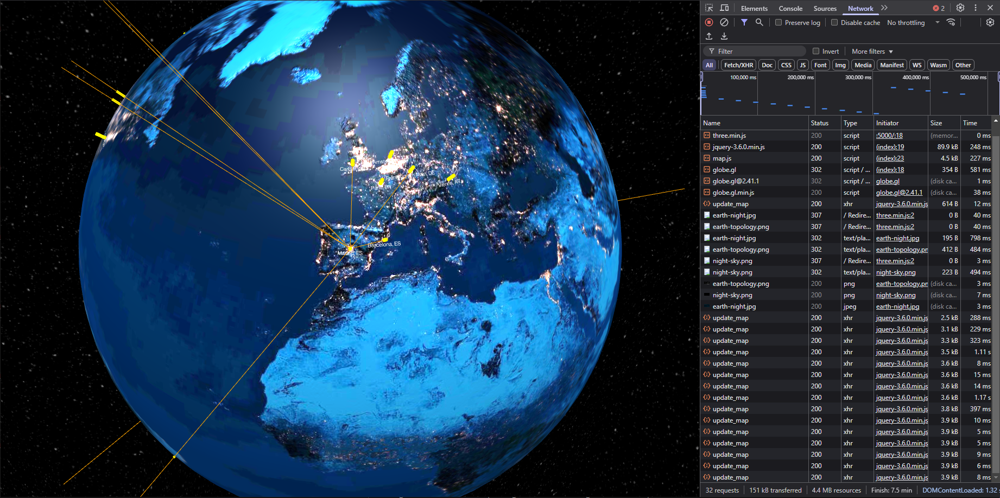

### Python TCP dump tool and packet geolocator

This tool captures TCP/UDP packets and provides geolocation information for the source and destination IP addresses.

#### Features
- Capture TCP packets in real-time
- Geolocate IP addresses using an external API
- Visualize packet paths on a 3D globe using the Globe.gl JavaScript library

#### Requirements
- Python 3.x
- Globe.gl
- Requests library

#### Installation
1. Clone the repository:
    ```sh
    git clone https://github.com/yourusername/pytcpdump.git
    ```
2. Install the required Python packages:
    ```sh
    pip install -r requirements.txt
    ```

#### Usage
Run the tool with the following command:
```sh
python pytcpdump.py
```

#### Screenshot
